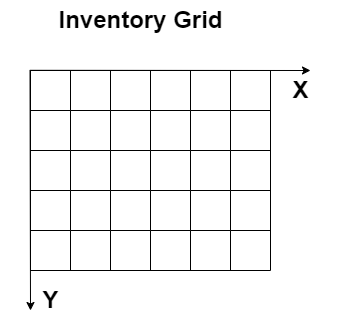
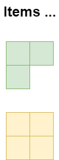
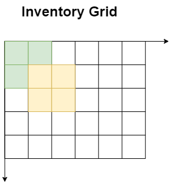
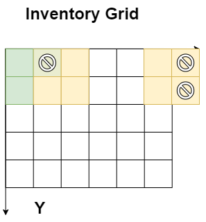
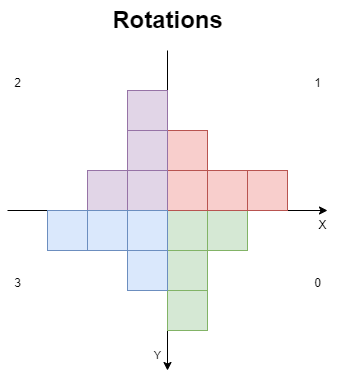

# Basic Inventory System (WIP)

## Инвентарь

Есть некоторое представление места в условном рюкзаке, выраженное в виде множества свободных клеток. Также существует некоторое множество предметов, которое также представленно в виде клеток:

Каждая клетка предмета занимает ровно одну клетку в рюкзаке. В свою очередь клетки предметов не могут делить одну свободную клетку друг с другом и выходить за пределы рюкзака.

Предметы можно также переворачивать на 90 градусов против часовой стрелки, как показано на рисунке (в углах количество поворотов):

## Характеристики персонажа

У персонажа есть следующие характеристики: сила и ловкость, максимальное здоровье и выносливость. Также есть характеристики, описывающие его текущее состояние: здоровье и выносливость. Персонаж еще может надевать и снимать снаряжение.

## Типы предметов

Предметы делятся на две категории:
* Расходники - после использования исчезают из инвентаря. При применении изменяют характеристики.
* Снаряжение - после использования исчезают из инвентаря и попадают в эфемерный слот для снаряжения. При применении также изменяют характеристики. Можно также вытащить из слота снаряжения.

## Инструменты

В качестве инструмента дан фреймворк Unity, который вы должны использовать в своей работе. Для работы с UI компонентами используем UI Toolkit. Для работы с зависимостями используем Zenject.

## Требуемый функционал

* Уметь добавлять, перетаскивать и переворачивать предметы в инвентаре.
* Уметь выкидывать предметы из инвентаря.
* Уметь использовать расходники.
* Уметь экипировать снаряжение, также как и его снимать.
* Уметь визуализировать информацию о инвентаре и характеристиках персонажа.

Все остальные детали на ваше усмотрение. В качестве бенчмарков реализации игрового инвентаря можно считать следующие игры:
* Resident Evil 4
* Escape from Tarkov